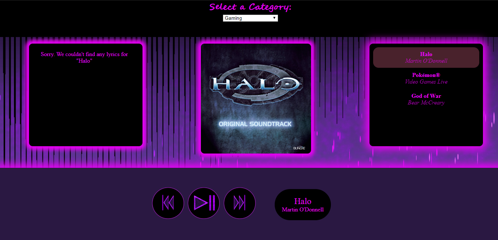

# Concatenated-Cats
Music streaming app that utilizes Spotify's API and Web Playback SDK as well as Lyrics.OVH API to allow Spotify Premium subscribers to view the lyrics of the currently playing track.

Check out the site [here](https://rjkaz.github.io/Concatenated-Cats/).

Unfortunately in order to use this app, you will need to be a spotify premium subscriber. If you can't use the app, you can see how it works through screenshots below. Video coming soon!

## usage
When the page loads, you will see an alert that tells you to log in. The button will redirect you to the Spotify login page. 

On success, you will be redirected back to our page and a toast will alert you of a successful log in.

If you are not subscribed to Spotify premium, you will be met with this page and unfortunately will not be able to use our web player app.

Once you have successfully logged into a Spotify premium account, you will get to this page where you can select the category to listen to.

We retrieve the first 20 categories Spotify suggests to your account, so it could be different on refresh.

Once you select a category, we randomly choose a playlist in that category to send to the webplayer. On the left side of the main content, we will display the lyrics for the currently playing song. In the center, you will see the album art of the currently playing song, and on the right side we display the songs in the playlist up to the last two played and next two to play.
The player object is on the bottom of the screen which contains the controls as well as the title and artist of the currently playing song. You can choose to toggle pause/play or go to the previous song or next song. 

If you choose to play a song that either has no lyrics, or if Lyrics.OVH cannot find the lyrics for the song based upon the title, the page will look much the same, except instead of displaying lyrics, the lyricbox will inform you that no lyrics were found:

The Spotify Web Playback SDK instantiates a new device object through which to stream Spotify. If you look at your Spotify app while you are using our site, you will see the currently playing track and that your account is streaming through our site:

## tech
* HTML
* CSS
* JavaScript & jQuery
* [AJAX (jQuery)](https://api.jquery.com/jquery.ajax/)
* [Spotify API](https://developer.spotify.com/documentation/web-api/)
* [Spotify Web Playback SDK](https://developer.spotify.com/documentation/web-playback-sdk/)
* [Lyrics.OVH API](https://lyricsovh.docs.apiary.io/#)
* [OAuth 2.0](https://oauth.net/articles/authentication/)

## credits
[Lee Chenalloy](https://github.com/chenallee) - JavaScript Lead

[RJ Kaz](https://github.com/RJKAZ) - Design Lead

[Joseph Puerari](https://github.com/jpuerari) - CSS Lead